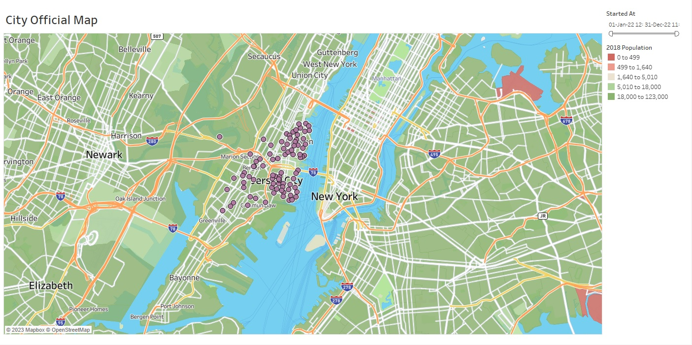
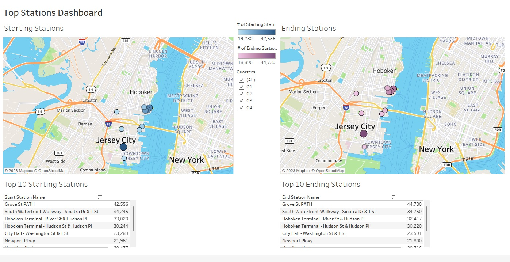
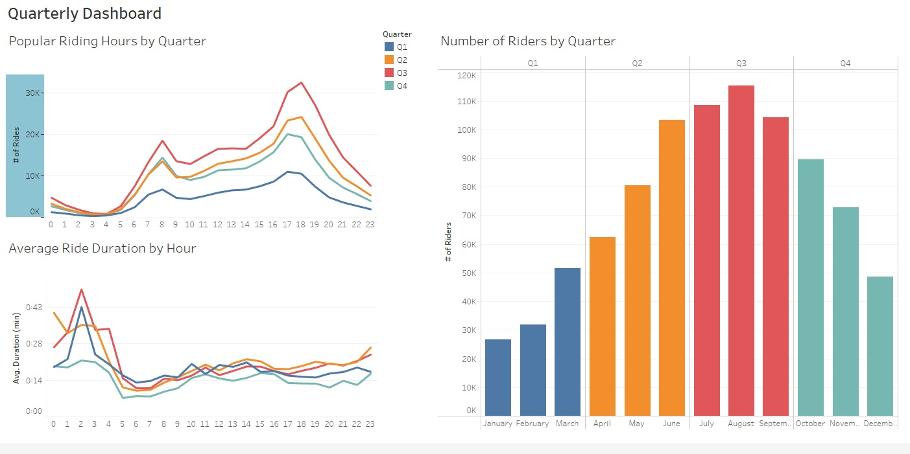

# Tableau Challenge

## Summary

The link to the dashboards and visualizations on Tableau Public is [here](https://public.tableau.com/app/profile/charlie.freeman6874/viz/CitibikeProject_16759957100090/Story).
In this project I am building dashboards and other visualizations using Tableau to relay information to city officials about the Citi Bike data from New York City.

## Tools

These are the tools, techniques and resources used in this project.

* Tableau is used for creating dashboards and other visuals
* Jupyter Notebook is used to combine the data into one file

### About the Data

Since 2013, the Citi Bike program has implemented a robust infrastructure for collecting data on the program's utilization. Each month, bike data is collected, organized and made public on the [Citi Bike Data](https://www.citibikenyc.com/system-data) webpage.

My visualizations use data from Calendar Year 2022.

## Page Details and Writeups

#### City Official Map

This visualization shows all bike stations used in 2022.  The more popular a station is, the darker the shade of purple will be.  Zip codes are colored according to 2018 Population from the US Census.  Users are able to use slider to restrict date range.

The main trend that is apparent in this visual is that the bike station in Jersey City is the most popular.

#### Top Stations Dashboard

The purpose of this visualization is to identify the stations bikers used most frequently.  It is broken into two maps providing starting (left) and stopping (right) stations while also displaying each stations values.  Users are able to select quarters of year that will affect all visuals.

#### Quarterly Dashboard

The first visual (top left) displays most popular riding hours for each quarter.  The peaks show popular riding time of 1700 which may possibly indicate customers using citibikes as a source of travel from work.

The second visual (bottom left) displays the average ride duration by hour.  It's rather alarming that the longer rides are happening earlier in the morning.

The third visual (right) displays the number of riders per quarter and month.  This data aligns with temperature.  Generally the warmer it is, the more customers are using bikes.